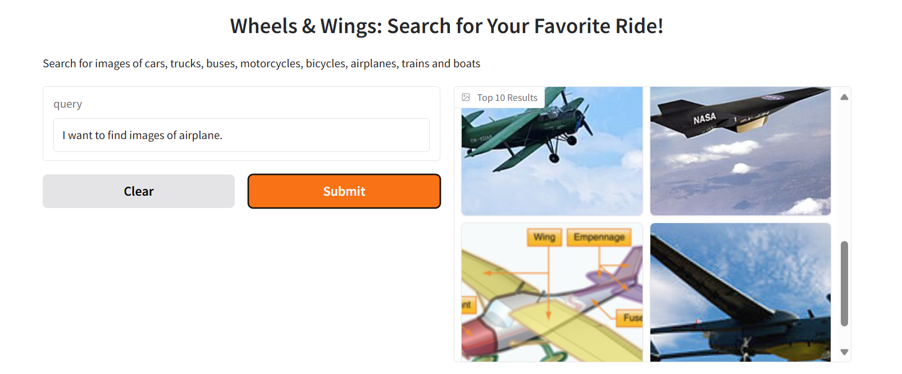
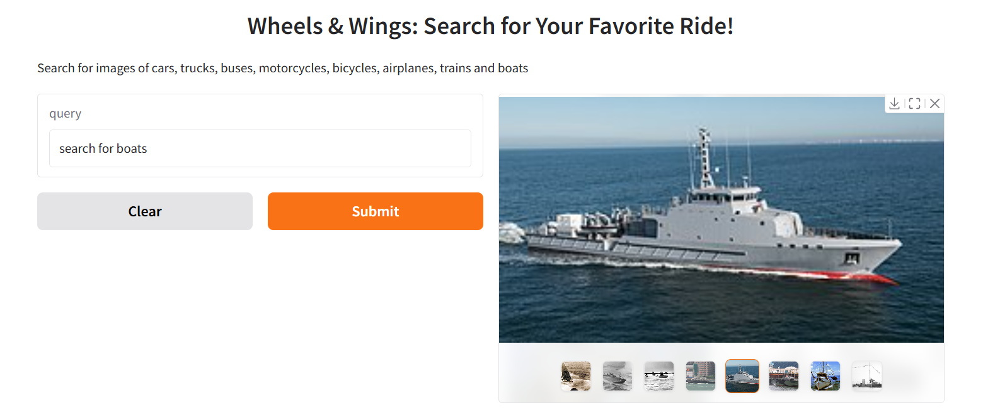
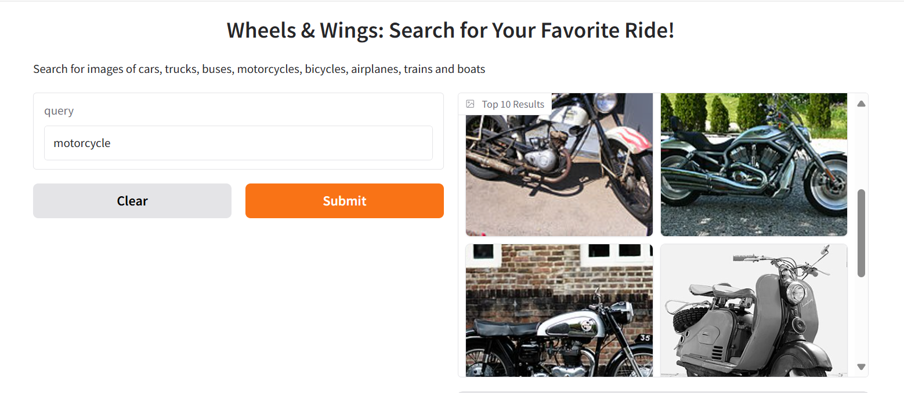

# Small-Scale-Image-Search

Image Search Engine with Web Crawling, CLIP, YOLO & BM25
This project is a full-stack image search engine that combines web crawling, deep learning-based object detection, natural language processing, and information retrieval techniques.
- Crawls Wikipedia to collect ~4000 images along with their associated HTML content.
-	Runs YOLOv8 and OpenAI’s CLIP to detect and describe visual content.
-	Combines image metadata, object labels, and HTML to generate rich annotations.
-	Cleans text using lemmatization, stop word removal, and special character filtering.
-	Builds an inverted index using TF-IDF weighting.
-	Retrieves top-ranked images using the BM25 ranking model.
-	Features a simple UI to visualize search results.
-	Includes evaluation metrics comparing retrieval performance against sample ground truth data.

This system bridges NLP, CV, and IR into a single pipeline for smart and interpretable image search.

Sample queries – “search for boats”, “motorcycle”, “I want to find images of airplane.”
   

